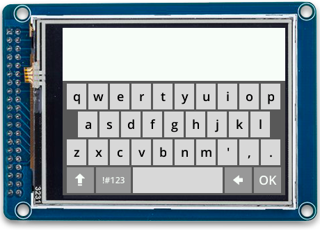

# Keyboard

The Keyboard module implements a touch screen keyboard with a responsive layout for use with Piu.

- **Source code:** [`keyboard.js`](../../modules/input/keyboard/keyboard.js)
- **Relevant Example:** [keyboard](../../examples/piu/keyboard/main.js)

The keyboard is implemented using a [`Port`](./piu.md#port-object) object that automatically fills its parent container, allowing it to reflow in a manner controlled by the application. The dictionary passed to the constructor configures properties of the keyboard.

Key presses trigger events that can be captured in the application's behavior. The style (font and weight) of the keyboard's text are driven by a [`Style`](./piu.md#style-object) object supplied by the caller. This allows the use of `Style` templates.

The keyboard implements a `doKeyboardTransitionOut` event that can be triggered to cause the keyboard to transition off-screen. When the transition is complete, the keyboard triggers an event to notify the application.

## Module Exports

|   Export    |     Type      | Description                                                   |
| :---------: | :-----------: | :------------------------------------------------------------ |
| `Keyboard`  | `constructor` | Constructor used to create Keyboard instances.                |
| `BACKSPACE` |   `string`    | Constant used to indicate that the backspace key was pressed. |
|  `SUBMIT`   |   `string`    | Constant used to indicate that the submit key was pressed.    |

```js
import { Keyboard, BACKSPACE, SUBMIT } from 'keyboard';
```

## Keyboard Object

### Constructor Description

#### `Keyboard(behaviorData, dictionary)`

|    Argument    |   Type   | Description                                                                                                                                                                                             |
| :------------: | :------: | :------------------------------------------------------------------------------------------------------------------------------------------------------------------------------------------------------ |
| `behaviorData` |   `*`    | A parameter that is passed into the `onCreate`function of the keyboard's `behavior`. This may be any type of object, including `null` or a dictionary with arbitrary parameters.                        |
|  `dictionary`  | `object` | An object with properties to configure the resulting keyboard. Only parameters specified in the [Dictionary](#keyboard-dictionary) section below will have an effect; other parameters will be ignored. |

Returns a `keyboard` instance, a `Port` object that uses an instance of the `KeyboardBehavior` class as its behavior.

```js
let OpenSans18 = new Style({ font: 'semibold 18px Open Sans', color: 'black' });
let keyboard = new Keyboard(null, { style: OpenSans18, doTransition: false });
```



<a id="keyboard-dictionary"></a>

### Dictionary

|     Parameter      |   Type    | Default Value | Description                                                                                   |
| :----------------: | :-------: | :-----------: | :-------------------------------------------------------------------------------------------- |
|      `style`       |  `style`  |      n/a      | **Required.** A Piu Style object that will be used for the text on keys.                      |
|     `bgColor`      | `string`  |  `"#5b5b5b"`  | The background fill color.                                                                    |
|   `doTransition`   | `boolean` |    `false`    | Whether or not to transition in the keyboard when it is first displayed.                      |
|     `keyColor`     | `string`  |  `"#d8d8d8"`  | The color for the character keys when not being pressed.                                      |
|   `keyDownColor`   | `string`  |  `"#999999"`  | The color for the character keys while they are being pressed.                                |
| `keyToggledColor`  | `string`  |  `"#7b7b7b"`  | The color for the character keys while they are being pressed.                                |
| `specialKeyColor`  | `string`  |  `"#999999"`  | The color for the special keys (shift, symbol, backspace, and submit) when not being pressed. |
| `specialTextColor` | `string`  |  `"#ffffff"`  | The color for the text on special keys (shift, symbol, backspace, and submit).                |
|      `submit`      | `string`  |    `"OK"`     | String to render on the submit key.                                                           |
|    `textColor`     | `string`  |  `"#000000"`  | The color for the text on character keys.                                                     |
|  `transitionTime`  | `number`  |     `250`     | The duration of the keyboard in/out transition in milliseconds.                               |

<a id="key-callback"></a>

### Triggered Events

#### `onKeyboardTransitionFinished()`

The keyboard will bubble this event when it is done transitioning off-screen. The `onKeyboardTransitionFinished` function will usually be implemented and triggered in the calling application's behavior.

---

#### `onKeyDown(key)`

| Argument |   Type   | Description                                                                                                                                                                                                                                      |
| :------: | :------: | :----------------------------------------------------------------------------------------------------------------------------------------------------------------------------------------------------------------------------------------------- |
|  `key`   | `string` | In most cases, the string will be the value of the key that is down (e.g. `"a"`, `"3"`, `"$"`). It can also be one of the two constants exported by the module: `BACKSPACE` or `SUBMIT` which indicate that those keys are down on the keyboard. |

The keyboard will bubble this event when a key is pressed down. The `onKeyDown` function will usually be implemented and triggered in the calling application's behavior.

---

#### `onKeyUp(key)`

| Argument |   Type   | Description                                                                                                                                                                                                                                                |
| :------: | :------: | :--------------------------------------------------------------------------------------------------------------------------------------------------------------------------------------------------------------------------------------------------------- |
|  `key`   | `string` | In most cases, the string will be the value of the key that was released (e.g. `"a"`, `"3"`, `"$"`). It can also be one of the two constants exported by the module: `BACKSPACE` or `SUBMIT` which indicate that those keys were released on the keyboard. |

The keyboard will bubble an event `onKeyUp` when a key is released. The `onKeyUp` function will usually be implemented and triggered in the calling application's behavior.

---

### Received Events

#### `doKeyboardTransitionOut(keyboard)`

|  Argument  |    Type    | Description                                    |
| :--------: | :--------: | :--------------------------------------------- |
| `keyboard` | `keyboard` | The `keyboard` object that received the event. |

This function can be triggered to cause the keyboard to transition off screen. When the transition is complete, the `onKeyboardTransitionFinished` event will be bubbled by the keyboard.

---
